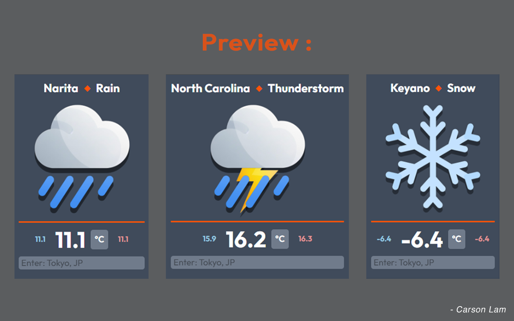

# WeatherMate Version 1.1.0

## Overview
WeatherMate is a minimalist and beautiful weather extension for google chrome designed to work on all devices.

## Version 1.1.0 Features

- Togglable Celcius & Fahrenheit

- Intuitive, direct UI & detailed weather data

- Weather Data retrieval for over 200,000 cities around the world

## Usage
Download from the [Chrome Web Store](https://chromewebstore.google.com/detail/dnhceagmmlgdhjidclcdjdojkboengol?utm_source=item-share-cb)

## Dependencies

- [Google Fonts - Outfit](https://fonts.google.com/specimen/Outfit)

- [Flaticon - rain and snow](https://www.flaticon.com/free-icons/rain) 

## Preview

